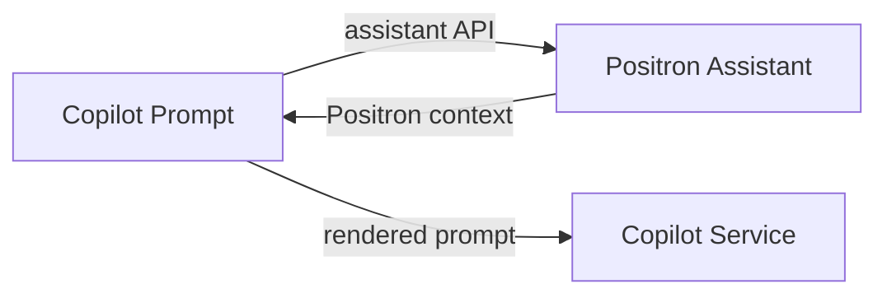

## Copilot Chat for Positron

This repository contains a fork of Microsoft's [Copilot Chat](https://github.com/microsoft/vscode-copilot-chat) extension modified for use in [Positron](https://positron.posit.co/).

> [!NOTE]
>
> This project is still in the experimental stage. For issues or questions, please refer to the [main Positron repository](https://github.com/posit-dev/positron)
## Development

### Embedding

This repository is included in Positron as a Git submodule. It becomes one of
Positron's built-in extensions.

### Recompiling

Unlike the other built-in extensions, this one doesn't support the incremental
Typescript compiler used by the extension watch process (`watch-extensionsd`).
This means that you must manually recompile the extension in order for changes
to take effect:

```bash
cd positron-copilot-chat
npm run compile
```

(There are also watch daemons that can observe and auto-recompile changes, but
there are three of them, so it's annoying to use them.)

### Release builds

When building for release, the extension "builds" with webpack in order to
integrate with Positron's build system. However, this webpack "build" really
just delegates to the extension's existing esbuild system (from upstream).

You can see how this works here:

https://github.com/posit-dev/positron-copilot-chat/blob/main/extension.webpack.config.js


### Integration with Positron Assistant

Copilot and Positron Assistant have parallel prompting systems. In general, the
Copilot prompts remain undisturbed in this repository; we simply inject a
Positron Assistant element into most of them containing Positron context for
the request. This provides Copilot's service with access to the active session
information, guidelines for writing code and using tools in Positron, etc.



The `<PositronAssistant>` prompt-tsx element is responsible for this
integration. You can find it here:

https://github.com/posit-dev/positron-copilot-chat/blob/main/src/extension/prompts/node/base/positronAssistant.tsx


### Merging Upstream

The coupling between the Copilot Chat extension and VS Code is extremely tight.
It is so tight, in fact, that the APIs is it user are neither forward nor
backwards compatible, and it is necessary to update this extension in lockstep
with VS Code itself. When taking new versions of VS Code, we need to do the
following:

- Create a branch of this repository before the upstream merge, so we have a
  place to hang any patches we need to take
- Reset to `main`
- Find the point in history where the VS Code dependency version was bumped.
  For example, if Positron is updating to VS Code 1.103, we need to find where
  the Copilot Chat upstream extension lost 1.103 compatibility, and point at
  the commit before that.
- Merge the history up to that point into Copilot Chat, resolving conflicts
- Include the submodule bump in the Positron upstream merge PR


